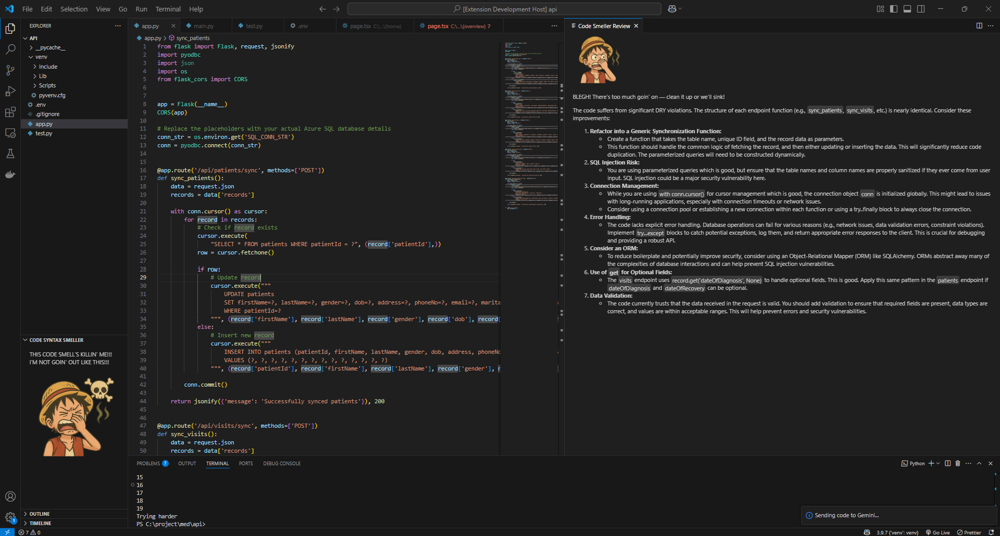

# 🧼 Code Smeller

**Code Smeller** is a fun, lightweight VS Code extension that helps developers write cleaner, more maintainable code using LLM-powered analysis. It reviews your code for:

- Poor or vague variable naming
- Refactoring opportunities (DRY, SRP, etc.)
- Violations of language/framework best practices

All feedback is shown in a friendly markdown-powered side panel — complete with a "smell score" and quote from your favorite anime crew to set the tone. Think of it as your AI-powered code reviewer... with personality.

---

## ✨ Features

- ✅ One-click code reviews using Gemini (via Google AI Studio)
- ✅ Feedback with concrete, useful suggestions (not pedantic!)
- ✅ Smell Score (1–5) with themed quotes for extra flair
- ✅ Supports JavaScript, TypeScript, Python
- ✅ Secure API key management via VS Code SecretStorage
- ✅ Local image support for smell score illustrations
- ✅ Near real-time syntax analysis while editing (experimental)

---

## 🖥️ Live Preview

Here’s what a typical code review looks like inside VS Code with Code Smeller:

---

## ⚙️ Extension Settings

This extension contributes the following VS Code settings:

| Setting              | Description                                                         |
| -------------------- | ------------------------------------------------------------------- |
| `codeSmeller.apiKey` | _(Optional)_ Store your Gemini API key. Prefer using SecretStorage. |

---

## 📦 Commands

| Command                            | Description                                             |
| ---------------------------------- | ------------------------------------------------------- |
| `Code Smeller: Smell Code`         | Run a Gemini-powered code review on the current file    |
| `Code Smeller: Set Gemini API Key` | Securely store your API key using VS Code SecretStorage |

---

## 🖼️ Smell Score System

Code Smeller assigns a **smell score** from 1 (clean) to 5 (disaster), using custom illustrations to match each level of code hygiene. The images appear in the side panel alongside Luffy-style quotes to keep things fun and helpful.

| Score | Meaning           | Visual Expression                         | Quote                                                |
| ----- | ----------------- | ----------------------------------------- | ---------------------------------------------------- |
| 1     | ✨ Squeaky clean  |  | “Shishishi~! This code’s tighter than anchor rope!”  |
| 2     | 🧐 Slightly off   |  | “Oi... it’s decent, but somethin’s off in the wind.” |
| 3     | 😐 Needs cleanup  |  | “It’s not the worst, but it needs serious polish.”   |
| 4     | 🤢 Smelly         |  | “Too much goin’ on — clean it up or we’ll sink!”     |
| 5     | ☠️ Code is lethal |  | “THIS CODE’S A DISASTER! PATCH THE HOLES!!”          |

Each review starts with the appropriate image and quote, followed by a markdown-rendered breakdown of real, actionable feedback.

---

## 🐞 Known Issues

- Markdown rendering may fail if CDN access to `marked.js` is blocked
- Very large files may be truncated due to token limits in the LLM
- TypeScript support depends on proper parser settings in the workspace
- Linting for languages beyond JS/TS/Python is not yet supported

---

## 🔐 Security Note

Your Gemini API key is stored securely using [VS Code SecretStorage](https://code.visualstudio.com/api/references/vscode-api#SecretStorage). You can update or remove it anytime via the Command Palette.

---

## 🤝 Contributing

PRs welcome! To add support for a new language or smell detection style, open an issue or submit a PR with your proposed config and review prompt style.

---

## 📜 License

MIT © 2025 Tolulope Jegede
